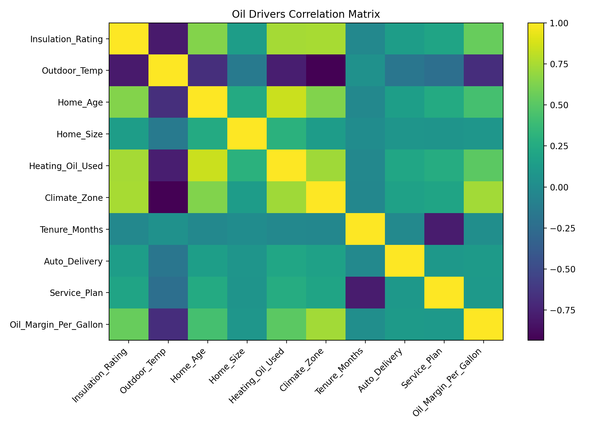
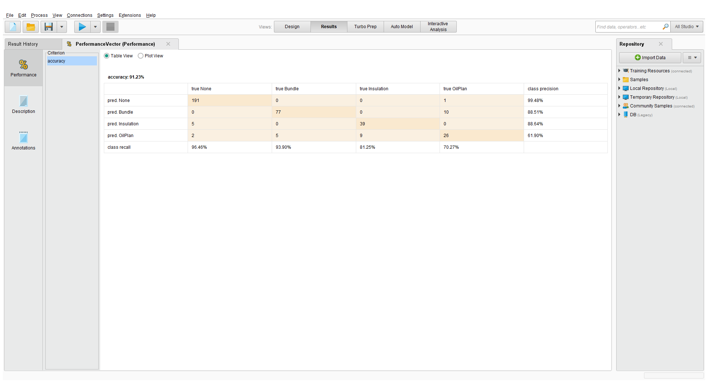

# Cedar & Flame Home Energy — Targeted Offer Modeling (RapidMiner → Python)

**Tagline:** Warm homes. Smarter costs.

## Overview
This portfolio project simulates a home-energy provider (“Cedar & Flame”) using customer/home attributes to:
- Segment customers by heating type
- Identify key drivers related to heating oil usage
- Prototype offer logic (rule-based label)
- Train an interpretable Decision Tree to recommend offers
- Export campaign-ready target lists (Excel/CSV)

> Note: This dataset and offers are simulated for portfolio demonstration.

## What the pipeline produces
- **EDA outputs:** numeric stats, missingness summary, histograms
- **Segment summary:** `heat_type_segment_summary.xlsx`
- **Correlation matrix:** `oil_drivers_corr_matrix.csv` + heatmap image
- **Model evaluation:** confusion matrix image + classification report
- **Scored customers:** offer recommendations + confidence columns
- **Campaign target list:** filtered to customers with recommended offers (excluding “None”)

## Brand assets (fictitious company)


## Key visuals
### Correlation Matrix (Oil Drivers)


### Decision Tree Confusion Matrix


## How to run
```bash
pip install -r requirements.txt
python src/heatingdata_pipeline.py
```
🌐 **PixelKraze Analytics (Portfolio):** https://pixelkraze.com/?utm_source=github&utm_medium=readme&utm_campaign=portfolio&utm_content=homepage
