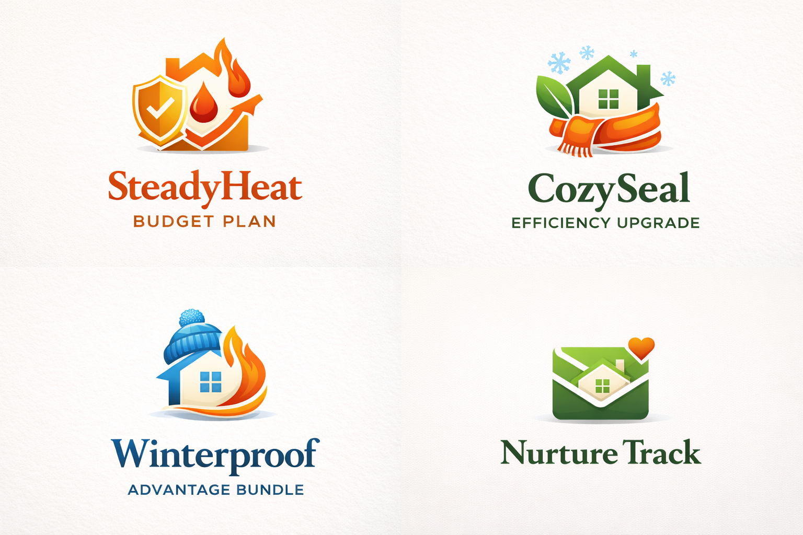
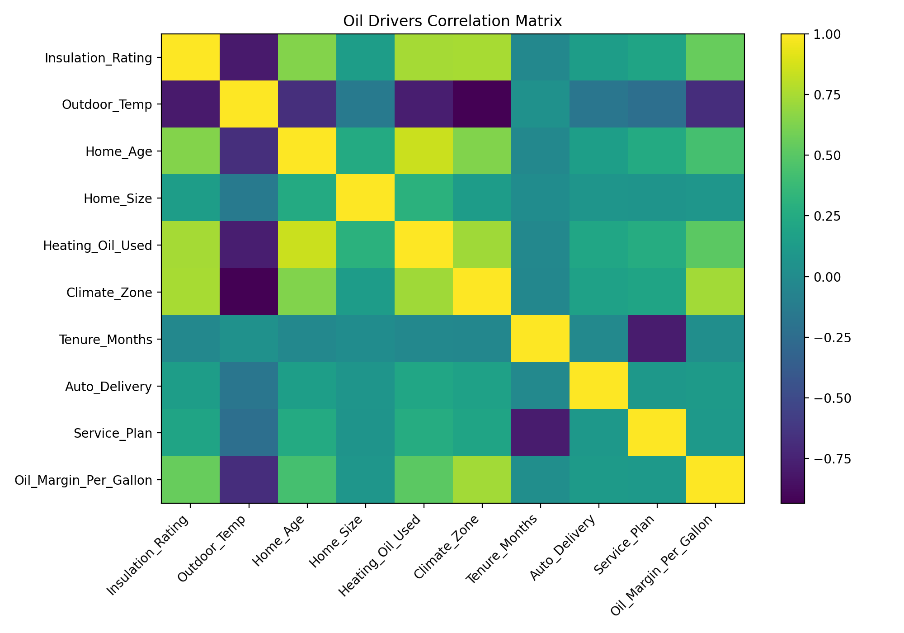
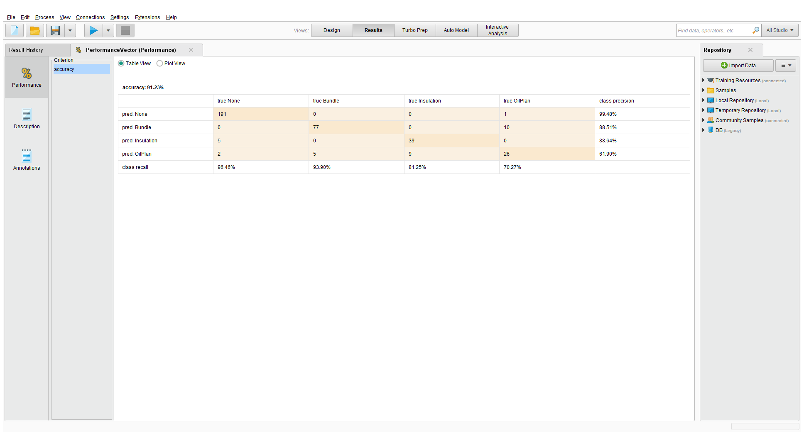

# Cedar & Flame Home Energy — Targeted Offer Modeling (RapidMiner → Python)

**Tagline:** Warm homes. Smarter costs.

## Overview
This portfolio project simulates a home-energy provider (“Cedar & Flame”) using customer/home attributes to:
- Segment customers by heating type
- Identify key drivers related to heating oil usage
- Prototype offer logic (rule-based label)
- Train an interpretable Decision Tree to recommend offers
- Export campaign-ready target lists (Excel/CSV)

> Note: This dataset and offers are simulated for portfolio demonstration.

## What the pipeline produces
- **EDA outputs:** numeric stats, missingness summary, histograms
- **Segment summary:** `heat_type_segment_summary.xlsx`
- **Correlation matrix:** `oil_drivers_corr_matrix.csv` + heatmap image
- **Model evaluation:** confusion matrix image + classification report
- **Scored customers:** offer recommendations + confidence columns
- **Campaign target list:** filtered to customers with recommended offers (excluding “None”)

## Brand assets (fictitious company)




## Key visuals
### Correlation Matrix (Oil Drivers)


### Decision Tree Confusion Matrix


## How to run
```bash
pip install -r requirements.txt
python src/heatingdata_pipeline.py
```
MIT License

Copyright (c) 2026 Gina Aulabaugh

Permission is hereby granted, free of charge, to any person obtaining a copy
of this software and associated documentation files (the "Software"), to deal
in the Software without restriction, including without limitation the rights
to use, copy, modify, merge, publish, distribute, sublicense, and/or sell
copies of the Software, and to permit persons to whom the Software is
furnished to do so, subject to the following conditions:

The above copyright notice and this permission notice shall be included in all
copies or substantial portions of the Software.

THE SOFTWARE IS PROVIDED "AS IS", WITHOUT WARRANTY OF ANY KIND, EXPRESS OR
IMPLIED, INCLUDING BUT NOT LIMITED TO THE WARRANTIES OF MERCHANTABILITY,
FITNESS FOR A PARTICULAR PURPOSE AND NONINFRINGEMENT. IN NO EVENT SHALL THE
AUTHORS OR COPYRIGHT HOLDERS BE LIABLE FOR ANY CLAIM, DAMAGES OR OTHER
LIABILITY, WHETHER IN AN ACTION OF CONTRACT, TORT OR OTHERWISE, ARISING FROM,
OUT OF OR IN CONNECTION WITH THE SOFTWARE OR THE USE OR OTHER DEALINGS IN THE
SOFTWARE.
🌐 **PixelKraze Analytics (Portfolio):** https://pixelkraze.com/?utm_source=github&utm_medium=readme&utm_campaign=portfolio&utm_content=homepage
